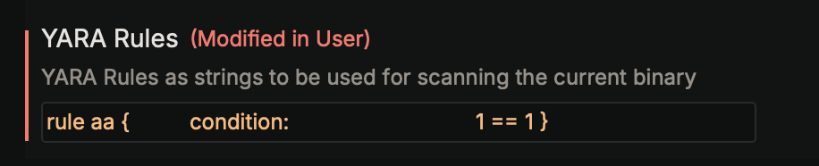
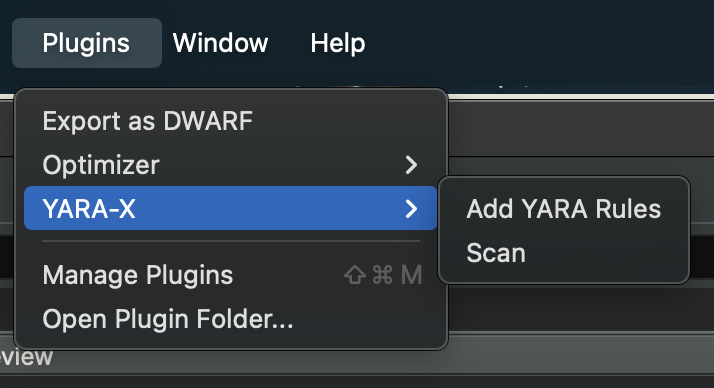
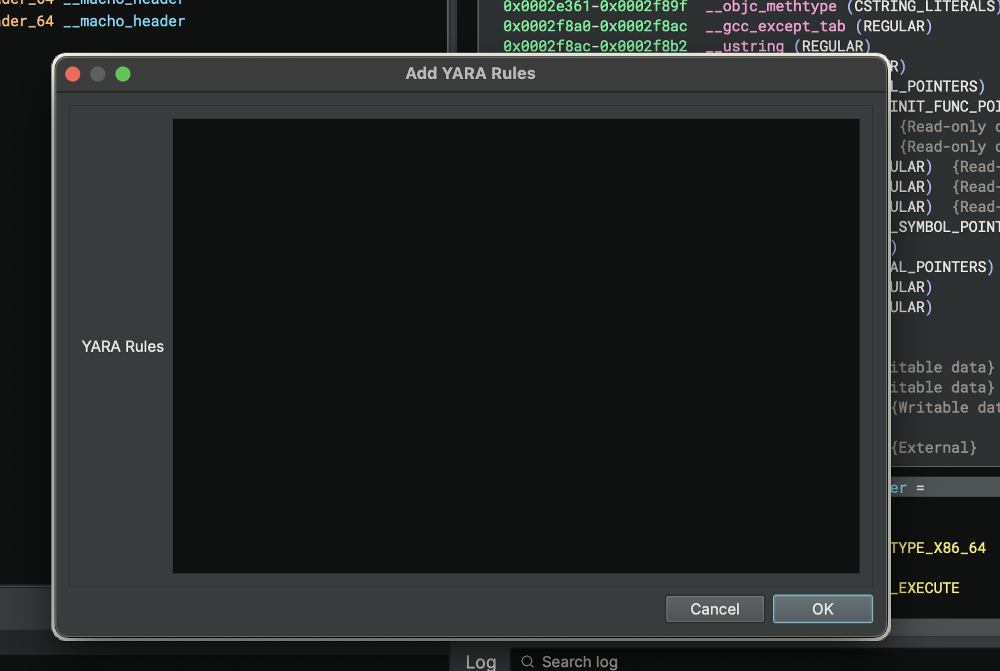
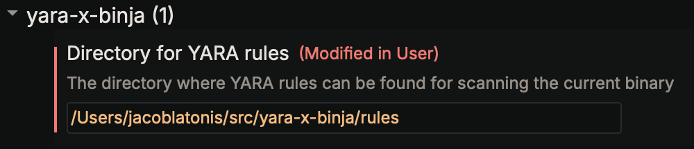

# yara-x-binja

`yara-x-binja` is a plugin written for [Binary Ninja](https://binary.ninja/) that allows a user to load a given set of [YARA rules](https://virustotal.github.io/yara-x/), scan the binary, and add tags in Binary Ninja where the matches occurred for each YARA rule.

## Installation

### Registry
1. Search for the `yara-x-binja` plugin via the Plugin Manager in Binary Ninja

### Local

1. Clone this git repository
    - `git clone git@github.com:latonis/yara-x-binja.git`

2. Build the plugin
    - `cargo build --release`

3. Install the plugin
    - macOS
        - `cp  ${PWD}/target/release/libyara_x_binja.dylib ~/Library/Application\ Support/Binary\ Ninja/plugins/`
    - *nix
        - `cp  ${PWD}/target/release/libyara_x_binja.so ~/.binaryninja/plugins/`

## Configuration
For configuration purposes, the user can provide one or both of these entries in the settings. The plugin will check for the existence of rules in both places.

1. Insert YARA rules into the plugin settings
    - `Preferences` > `yara-x-binja` > `YARA Rules`
    
    - `Plugins` > `YARA-X` > `Add YARA Rules`
    
        - Paste rule(s) into the form
        
2. Provide a diectory where YARA rules reside
    - `Preferences` > `yara-x-binja` > `Directory for YARA rules`
    

## Usage

1. Run the plugin
    - `Plugins` > `YARA-X` > `Scan`
2. Profit

